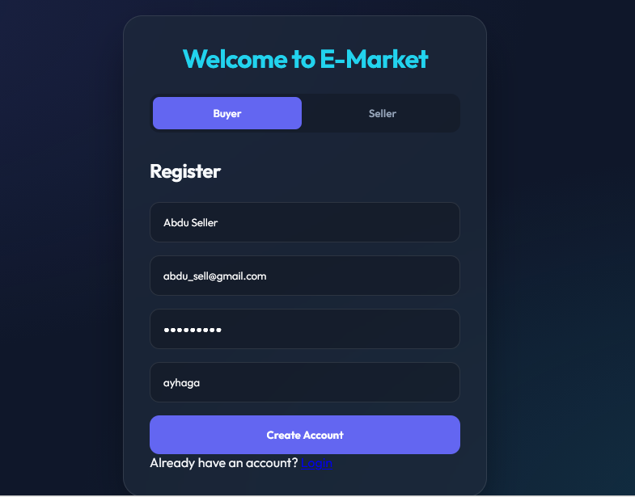
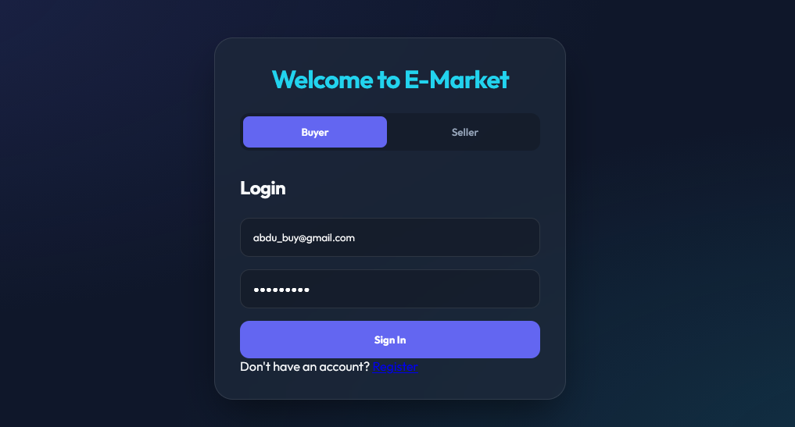
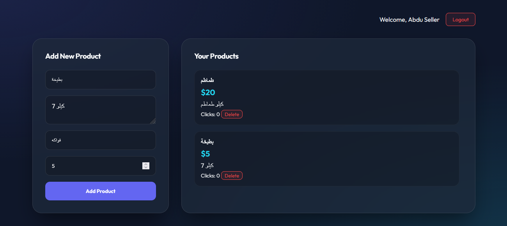

# Marketplace API

A robust E-commerce Marketplace API built with Node.js and Express, allowing users to register as either Buyers or Sellers. Sellers can manage their products, while Buyers can browse and purchase items.

##  Features

- **Authentication**: Secure registration and login using JWT and Bcrypt.
- **Role-based Access**: Different permissions for Buyers and Sellers.
- **Product Management**: Sellers can create, update, and delete their products.
- **Marketplace Browsing**: Buyers can view all available products.
- **Transactions**: Simple workflow for buying products.

##  Tech Stack

- **Backend**: Node.js, Express.js
- **Database**: MongoDB (via Mongoose)
- **Security**: JWT (JSON Web Tokens), Bcrypt
- **Validation**: Validator.js

##  Some Screenshots

### Authentication
| Register | Login |
| :---: | :---: |
|  |  |

### Seller Dashboard (Add Products)


##  Project Structure

```text
├── controllers/    # Request handlers
├── db/             # Database connection setup
├── images/         # Project screenshots
├── middleware/     # Custom Express middleware (auth, etc.)
├── models/         # Mongoose schemas
├── routes/         # API endpoint definitions
├── public/         # Static files
└── app.js          # Entry point
```

##  Getting Started

1. **Clone the repository**
2. **Install dependencies**:
   ```bash
   npm install
   ```
3. **Set up environment variables**:
   Create a `.env` file in the root directory and add your MongoDB URI and JWT Secret.
4. **Run the server**:
   ```bash
   # Production
   npm start
   
   # Development
   npm run dev
   ```
